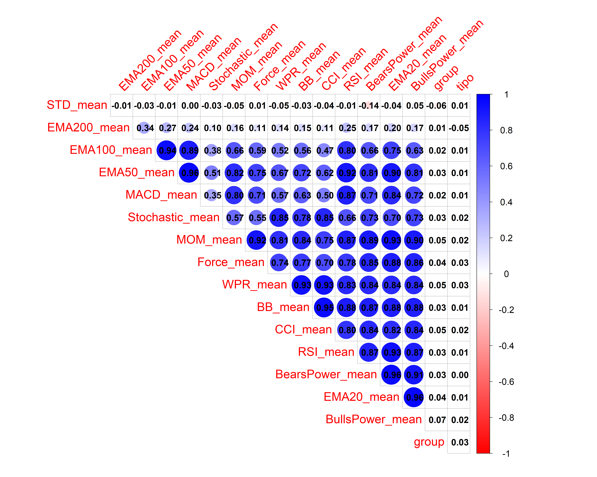

```{r}
# Load necessary libraries
library(tidyverse)
library(corrplot)
library(brms)
```

```{r}
# Load the new dataset
data <- read.csv("dataset_preprocessed.csv")
# Drop rows with missing values
data <- data %>% drop_na()
```

## Plotting The correlation Matrix to Select Features
```{r}
subset_features <- data %>%
  select(RSI_mean, Stochastic_mean, EMA20_mean, EMA50_mean, EMA100_mean, EMA200_mean, 
         STD_mean, MOM_mean, BB_mean, CCI_mean, Force_mean, MACD_mean, 
         BearsPower_mean, BullsPower_mean, WPR_mean, group, tipo)

# Compute the correlation matrix for the subset
cor_matrix_subset <- cor(subset_features, use = "complete.obs")
```

```{r}
# Adjust the plot and export as a PNG
png("correlation_matrix_all.png", width = 5000, height = 4000, res = 300)
corrplot(
  cor_matrix_subset,                # Correlation matrix
  method = "circle",         # Circle representation
  type = "upper",            # Display upper triangle
  order = "hclust",          # Cluster similar features
  tl.cex = 2,                # Increase label font size
  tl.srt = 45,               # Rotate column labels
  addCoef.col = "black",     # Add correlation coefficients
  cl.cex = 1.5,              # Increase legend font size
  number.cex = 1.5,          # Adjust text size of correlation coefficients
  col = colorRampPalette(c("red", "white", "blue"))(200), # Custom color palette
  diag = FALSE               # Exclude diagonal
)

```



##  Correlation Analysis 
Features with Correlations Below 0.8:
STD_mean: Has very weak correlations (close to 0) with all other features.
EMA200_mean: Correlations with MACD_mean, Stochastic_mean, and Force_mean are less than 0.8.
EMA100_mean: Correlations with MACD_mean, Stochastic_mean, and Force_mean are less than 0.8.
EMA50_mean: Correlations with MACD_mean, Stochastic_mean, and Force_mean are less than 0.8.
MACD_mean: Correlations with STD_mean, EMA200_mean, EMA100_mean, EMA50_mean, Stochastic_mean, and Force_mean are less than 0.8.
Stochastic_mean: Correlations with STD_mean, EMA200_mean, EMA100_mean, and EMA50_mean are less than 0.8.
MOM_mean: Correlation with Force_mean is less than 0.8.
Force_mean: Correlations with STD_mean, EMA200_mean, EMA100_mean, EMA50_mean, MACD_mean, Stochastic_mean, and MOM_mean are less than 0.8.
CCI_mean: Correlations with STD_mean, MACD_mean, Force_mean, and Stochastic_mean are less than 0.8.
RSI_mean: Correlations with STD_mean and Force_mean are less than 0.8.
group: Has negligible correlations (close to 0) with all other features.


Selected Features:
EMA200_mean, EMA100_mean, EMA50_mean: These are highly correlated (above 0.8). We select EMA200_mean as a representative feature because it reflects longer-term trends, often more robust in financial modeling.
MOM_mean, WPR_mean, BB_mean: These features are strongly correlated. Select MOM_mean, as momentum is a widely used predictor in financial forecasting.

Features with Moderate or Weak Correlations:
MACD_mean: A key technical indicator for identifying trends and potential reversals, with correlations below 0.8 with EMA* and other features.
Stochastic_mean: Measures momentum and provides complementary information to MOM_mean.
Force_mean: Shows weak to moderate correlations with other features and can capture unique aspects of market activity.
CCI_mean: Measures deviations from a moving average and has correlations below 0.8 with other features.
RSI_mean: Provides insights into overbought or oversold conditions and has weak correlations with other features.
STD_mean: Though its correlations with other features are negligible, it could add unique information regarding price volatility.


##  Fitting Model 1 
Logistic Regression

```{r}
formula1 = tipo ~ RSI_mean + Stochastic_mean + EMA200_mean + STD_mean + MOM_mean + CCI_mean + MACD_mean + Force_mean 

prior1 <- set_prior("normal(0, 1)", class = "b") + 
         set_prior("normal(0, 1)", class = "Intercept")
```

```{r}
 fit_model1 <- brm(
   formula = formula1,
   data = data,
   family = bernoulli(link = "logit"),
   prior = prior1,
   chains = 4, iter = 2000, warmup = 1000, cores = 4
 )
```


##  Fitting Model 2 
Hierarchical Logistic Regression:
Modeling Group-Specific Variability: Captures differences in the behavior of forex movements across trading hours/days.
Pooling Information Across Groups: Hierarchical models perform partial pooling, improving estimates in groups with sparse data.
Improved Generalization: By accounting for group-specific patterns, the model can generalize better to unseen data.
Interpretation of Random Effects: Quantifies the variability across groups, giving insights into the influence of temporal factors.

The feature "group" (a combination of Hour and DayOfWeek) can be considered a natural grouping factor because: 1. It aligns with temporal dependencies in forex trading, where market behavior varies by time and day. 2. Forex markets experience different levels of activity during different hours and days (e.g., higher activity during overlaps of major market sessions like London/New York).

In our case, grouping by Hour and DayOfWeek captures temporal structures. This grouping reflects the intuition that Forex markets behave differently based on the time of day or day of the week.

```{r}
formula2 = tipo ~ RSI_mean + Stochastic_mean + EMA200_mean + STD_mean + MOM_mean + CCI_mean + MACD_mean + Force_mean + (1 | group) # Random intercept by group

prior2 <- set_prior("normal(0, 1)", class = "b") + 
         set_prior("cauchy(0, 1)", class = "sd")
```

```{r}
  # Fit the hierarchical logistic regression model
  fit_model2 <- brm(
    formula = formula2,
    data = data,
    family = bernoulli(link = "logit"),  # Logistic regression
    prior = prior2,
    chains = 4, iter = 2000, warmup = 1000, cores = 4
  )
```

```{r}
saveRDS(fit_model1, file = "fit_model1.rds")
saveRDS(fit_model2, file = "fit_model2.rds")
```


##  Models For Sensitivity & Exchangeability

```{r}
 # Fit model with Normal(0, 10) prior
 fit_model2_normal_10 <- brm(
   formula = formula2,                     
   data = data,                           
   family = bernoulli(link = "logit"),     
   prior = prior(normal(0, 10), class = "b"),  #"07_GLM.pdf" slide 29
   chains = 4, iter = 2000, warmup = 1000, cores = 4, seed = 123
 )
```


```{r}
 # Fit model with Normal(0, 1) prior
 fit_model2_normal_1 <- brm(
   formula = formula2,
   data = data,
   family = bernoulli(link = "logit"),
   prior = prior(normal(0, 1), class = "b"),  # Normal(0, 1) prior "12_prior_specification.pdf" slide 35
   chains = 4, iter = 2000, warmup = 1000, cores = 4, seed = 123
 )
```

```{r}
 # Fit model with Exponential(1) prior
 fit_model2_exponential <- brm(
   formula = formula2,
   data = data,
   family = bernoulli(link = "logit"),
   prior = prior(exponential(1), class = "sd"),  # Exponential(1) prior, "12_prior_specification.pdf" slide 42
   chains = 4, iter = 2000, warmup = 1000, cores = 4, seed = 123
 )
```

```{r}
 # Fit model with Student-t(3, 0, 1) prior
 fit_model2_student_t <- brm(
   formula = formula2,
   data = data,
   family = bernoulli(link = "logit"),
   prior = prior(student_t(3, 0, 1), class = "b"),  # Student-t(3, 0, 1) prior , "12_prior_specification.pdf" slide 19
   chains = 4, iter = 2000, warmup = 1000, cores = 4, seed = 123
 )
```

```{r}
 # Fit model with Flat (Uniform) prior
 fit_model2_flat <- brm(
   formula = formula2,
   data = data,
   family = bernoulli(link = "logit"),
   # Flat prior: In brms, not specifying a prior for a parameter will often default to a non-informative flat prior.,  "07_GLM.pdf" slide 28
   chains = 4, iter = 2000, warmup = 1000, cores = 4, seed = 123
 )
```


```{r}
 saveRDS(fit_model2_normal_10, file = "fit_model2_normal_10.rds")
 saveRDS(fit_model2_normal_1, file = "fit_model2_normal_1.rds")
 saveRDS(fit_model2_exponential, file = "fit_model2_exponential.rds")
 saveRDS(fit_model2_student_t, file = "fit_model2_student_t.rds")
 saveRDS(fit_model2_flat, file = "fit_model2_flat.rds")
```


##  Models for Extreme Prior Sensitivity Test 

```{r}
 # Fit model with Normal(0, 100) prior
 fit_model2_normal_100 <- brm(
   formula = formula2,
   data = data,
   family = bernoulli(link = "logit"),
   prior = prior(normal(0, 100), class = "b"),  # Normal(0, 1) prior "12_prior_specification.pdf" slide 35
   chains = 4, iter = 2000, warmup = 1000, cores = 4, seed = 123
 )
```

```{r}
 # Fit model with Exponential(5) prior
 fit_model2_exponential5 <- brm(
   formula = formula2,
   data = data,
   family = bernoulli(link = "logit"),
   prior = prior(exponential(5), class = "sd"),  # Exponential(1) prior, "12_prior_specification.pdf" slide 42
   chains = 4, iter = 2000, warmup = 1000, cores = 4, seed = 123
 )
```
 
```{r}
  saveRDS(fit_model2_exponential5, file = "fit_model2_exponential5.rds")
  saveRDS(fit_model2_normal_100, file = "fit_model2_normal_100.rds")
```


##  Models for Exchangeability Test
```{r}
exchangeability_data <- read.csv("exchangeability_dataset.csv")
```

```{r}
formula3 = tipo ~ RSI_mean + Stochastic_mean + EMA200_mean + STD_mean + MOM_mean + CCI_mean + MACD_mean + Force_mean + (1 | hour) # Random intercept by group

prior3 <- set_prior("normal(0, 1)", class = "b") + 
         set_prior("cauchy(0, 1)", class = "sd")
```

```{r}
  # Fit the hierarchical logistic regression model
  fit_model_exchangeability <- brm(
    formula = formula3,
    data = exchangeability_data,
    family = bernoulli(link = "logit"),  # Logistic regression
    prior = prior2,
    chains = 4, iter = 2000, warmup = 1000, cores = 4
  )
```
```{r}
saveRDS(fit_model_exchangeability, file = "fit_model_exchangeability.rds")
```

